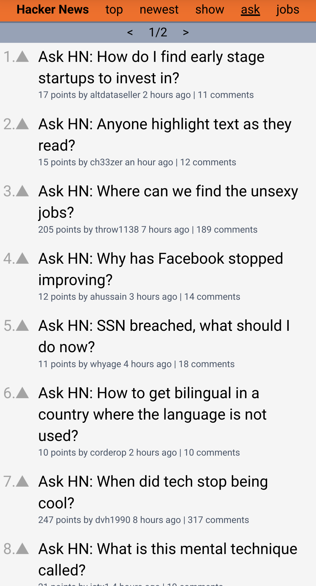

# HNPWA

A Hacker News [Progressive Web App](https://web.dev/progressive-web-apps/) built using: 
- [React v18](https://reactjs.org/)
- [React Router v6](https://reactrouter.com/)
- [TailwindCSS v3](https://tailwindcss.com/)

A demo site hosted on fly.io [here](https://hnrtwpwa.fly.dev/).   
Data is supplied from the [HNPWA API](https://github.com/tastejs/hacker-news-pwas/blob/master/docs/api.md).  
This was just a fun little side project to learn about React and PWAs, and I had a lot of fun doing it :)  

## Usage

Start the development server using:
```
npm start
```

Run the app in a docker container using:
```
docker compose up -d --build
```

## Screenshots

  